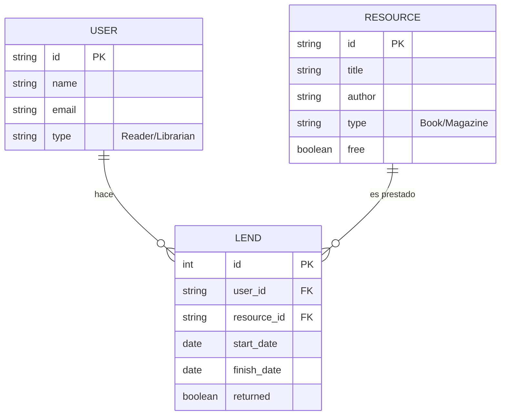

```mermaid
erDiagram
    USER ||--o{ LEND : "hace"
    RESOURCE ||--o{ LEND : "es prestado"
    
    USER {
        string id PK
        string name
        string email
        string type "Reader/Librarian"
    }

    RESOURCE {
        string id PK
        string title
        string author
        string type "Book/Magazine"
        boolean free
    }

    LEND {
        int id PK
        string user_id FK
        string resource_id FK
        date start_date
        date finish_date
        boolean returned
    }
```